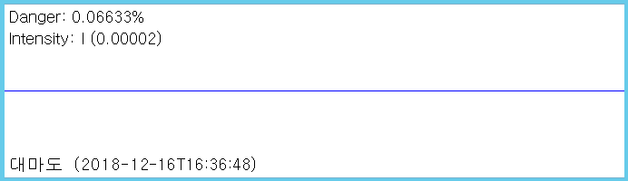

# Wave Viewer

Realtime seismograph wave viewer.

## Example

> WaveViewer --type slink --name 대마도 --gain 1.0e+07 --danger 0.03 --accel false --len 3072 --zoom 4 --channel BHZ --network JP --station JTU

